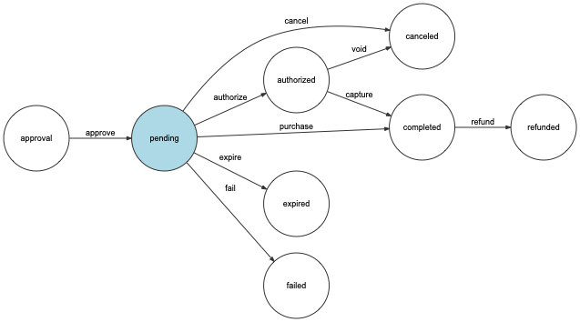

# DarvinPaymentBundle
This Omnipay-based bundle provides basic payment logic for Symfony applications.

## Features:

- creating payment
- approving payment before purchase
- standard purchase and purchase with pre-authorise
- refund or canceling payment
- the sending notify emails of every changed payment state
- logging every actions in log and Event entity
- provides the interface for the adding receipt to payment

## Payment states

To manage payment state used Symfony Workflow Component.

Scheme of payment state changes:



## Installation
```bash
    composer require darvinstudio/darvin-payment-bundle
```

## Creating Payment:
```php
    /** @var $paymentFactory \Darvin\PaymentBundle\Payment\Factory\PaymentFactoryInterface */
    $payment = $paymentFactory->createPayment(
        new PaidOrder(
            (string)$order->getId(),
            get_class($order),
            (string)$order->getNumber()
        ),
        $order->getPrice(),
        new Client(
            (string)$user->getId(),
            get_class($user),
            $user->getEmail()
        ),
        'USD'
    );
```

## Show available payment links
PaymentBundle has twig function for show every available payment methods of order. It can use for success page, email notify or for show in personal account.
```twig
    {{ payment_purchase_widget(order) }}
```
